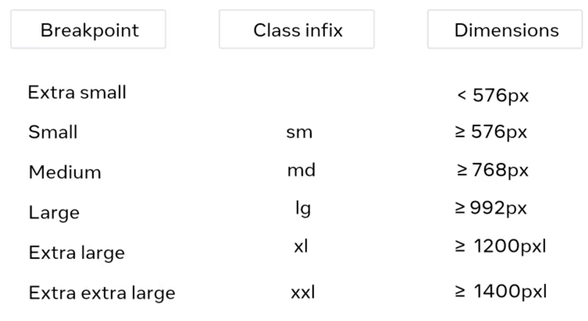

# Introduction to Front-End Developement

## Module 3 - UI Frameworks

### Libraries:
- you can include CSS and JavaScript libraries in your HTML file, to spare time for your
- you deploy your application to a web server, and you must include the libraries and frameworks along with it
- if you don't include them, your application won't be able to call the API functions it needs to execute, when you run it 
    --> this is why libraries and frameworks are often referred to as dependencies. Your application depends on them. 
- **Bootstrap library**: popular to develop user interfaces, it providec CSS and JS libraries
- you can reference to CSS libraries in your HTML head section: 
```
<link href="here_comes_the_CSS_library_link_you_use" rel="stylesheet">
```
- refer to JS library in the HTML body section: 
```
<script src="here_comes_the_JS_library_link_you_use"></sript>
```
- it enables enhanced funcionalities such as drop-down and tooltips. <br>
- you can have hundreds of dependencies in your project. It is hard to handle them, and to make sure that everyone else in the team use the same version of the library or framework you use. This is where package manager comes in. 
- **Package manager** is a tool that automatically downloads and installs dependencies / packages. A package manager also provides the capability to publish your own packages.
- **NPM (Node Package Manager)**: the most common package manager for front-end developement. 
- Once you download all dependencies / packages, you need to add them to the HTML file. But adding them one by one would take forever. This is where bundling tool comes in. 
- The purpose of the bundler is to automatically combine dependencies / packages into a single file. (Bundlers: **Gulp, Webpack**).  

### Responsive design:
- Responsive design means that a web page can automatically strech or shrink depending on the screen is displayed on
- Thanks to responsive design, websites can be correctly displayed on any of your devices
- High resolution screens (like smartphones): group multiple physical pixels into one logical pixel to display smoother images and text
- Responsive design is a set of three practices that allows a website to automatically change its visuals.
    1. Flexible grids: are made up of columns, guttrers (the space between the columns) and margins (the space between the contents). Flexible grids are defined in percentage values, allowing them to adjust depending on screen size
    2. Fluid images: you provide 100% percentage to the max width property, so the image will scale down smaller if you shrink the scale
    3. Media queries: they allow developers to query the display size, orientation and aspect ratio to conditionally apply CSS rules 

### Bootstrap

Bootstrap is often described as a way to "**build fast, responsive sites**" and it is a "**feature-packed, powerful, and extensible frontend toolkit**". 

**Bootstrap is a library of CSS and JavaScript code that you can combine to quickly build visually appealing websites**.

Modern web development is all about **components**. Small pieces of reusable code that allow you to build websites quickly. Bootstrap comes with multiple components for very fast construction of multiple components, or parts of components. 

Another important aspect of modern development is **responsive grids** which allow web pages to adapt their layout and content depending on the device in which they are viewed. Bootstrap comes with a pre-made set of CSS rules for building a responsive grid.

Bootstrap **saves significant time** because all the CSS code that styles its grid and pre-built components is already written. Instead of needing a high level of expertise in various CSS concepts, you can simply use the existing Bootstrap CSS classes to create visually appealing websites. 

Bootstrap is a collection of pre-written code chunks in CSS and JS which allows you to create websites more quickly. No need to build websites from scratch every time.  

**Let's create a simply webpage with Bootstrap**:
- first create the container element 
```
<div class="container">
    <div class="row">
        <h1>Our Menu</h1>
    </div>
    <div class="row">
        <div class="col">
            <h2>Falafel</h2>
            <p>Chickpea, herbs and spices</p>
            <h2>Pasta Salad</h2>
            <p>Vegetables, lettuce and chrispy chicken.</p>
        </div>
        <div class="col">
            <h2>Prices</h2>
            <table class="prices">
                <tr>
                    <td>Falafel</td>
                    <td>$12.00</td>
                </tr>
                <tr>
                    <td>Pasta Salad</td>
                    <td>$10.00</td>
                </tr>
            </table>
        </div>
    </div>
</div>
```
- You don't have to redesign your website for each device.

#### Bootstrap CSS Class Infixes and modifiers

**Infixes**:  you use them for responsive breakpoints in the Bootstrap grid system. <br>
Breakpoints are the triggers in Bootstrap for how your layout changes across device or viewpoint sizes
 
 

 **Modifiers**: 
  - primary (blue color by default)
  - secondary 
  - success
  - info
  - warning
  - danger (red color by degault)
  - light
  - dark 

- Bootstrap provides an easy way to create predefined alert messages 

What is the function of alerts in Bootstrap? To show information needing immediate attention.

#### Bootstrap grid:
The Bootstrap grid system helps us to create web page layouts through a seriese of rows and columns that house our content. 
Bootstrap uses a 12 lumns grid system that can be fluid or fixed. 
The container is always the root element of the grid 

What is the primary function of the Bootstrap grid system? To create web page layouts using a 12-column grid system.

How is column sizing adjusted in Bootstrap? By suffixing a number to the column CSS class to specify column width.

What role do responsive breakpoints play in Bootstrap? They determine container width and allow different layouts based on the device.

### Static vs. dynamic content 

- The content, which is sent to your browser from the web server, can be dynamic or static. 
- Static content is files that the server transfers just as they are stored on the web server, such as videos or images. 
- Dynamic content is generated when the HTTP request is made. For example, the content is generated based on the input from a user. 
What actually happens, that the web server communicates with another kind of server (application server or back-end).
The application server generates the the dynamic content that the web server sends back to the user's browser.


