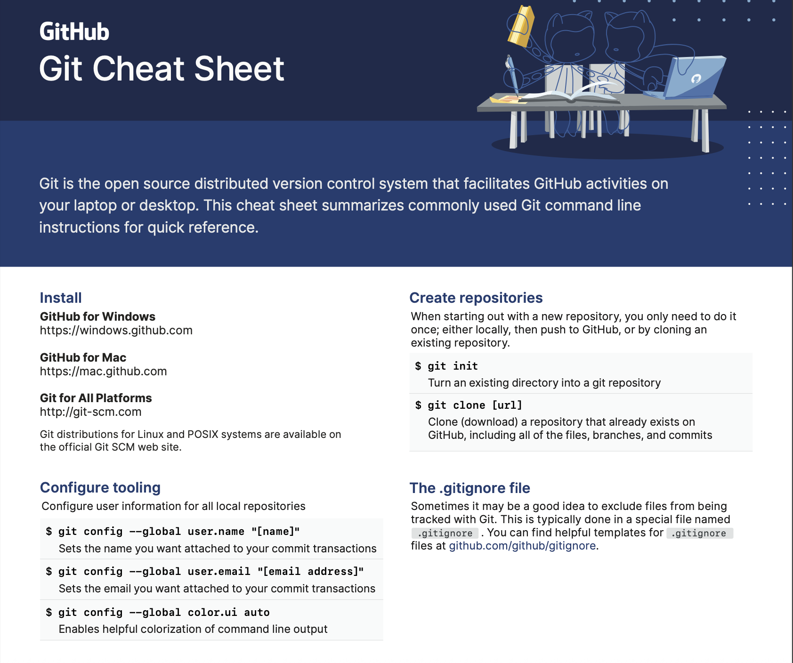
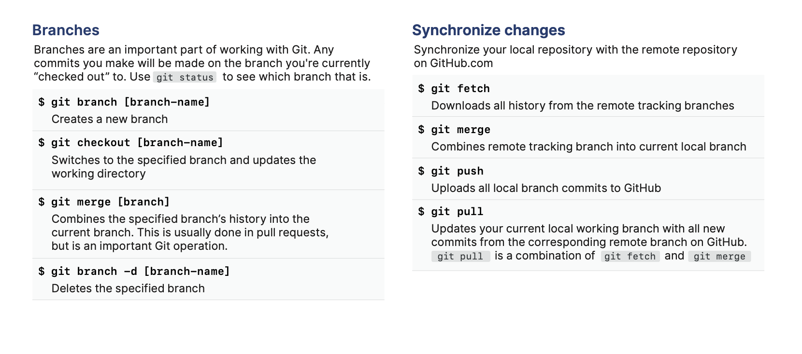
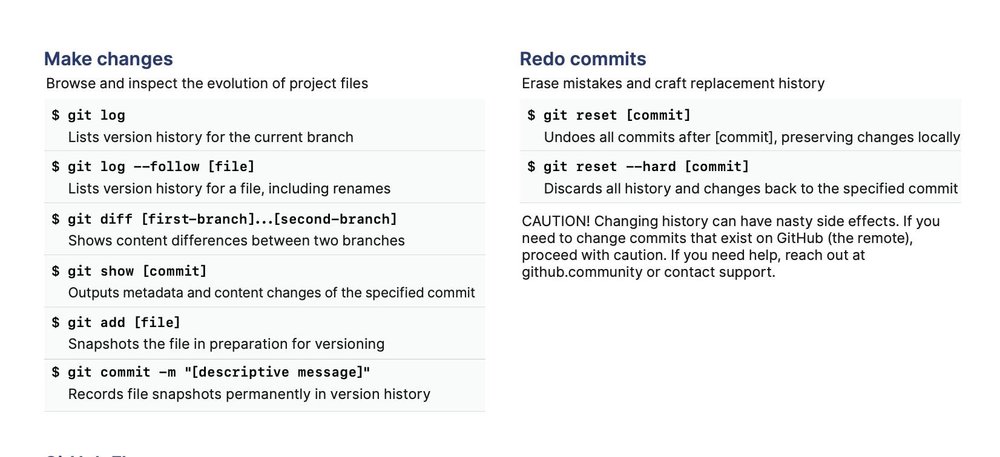
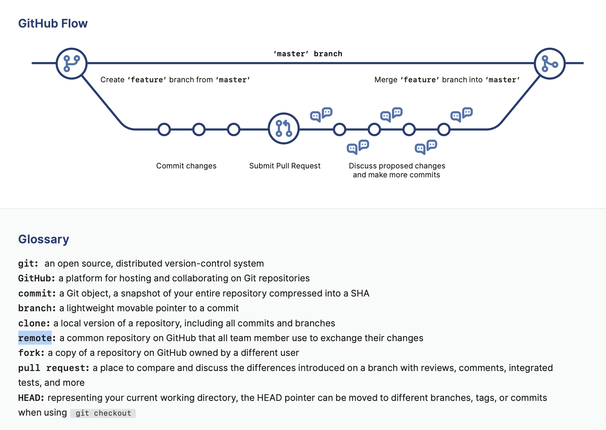

# Version Control Course 

Source: Version Control: https://www.coursera.org/learn/introduction-to-version-control?specialization=meta-full-stack-developer

## Module1 - Software Collaboration (1-17)

### 1. Introduction to the Course (video)

- **Version Control**: is a practice of tracking and managing changes to files over time. It allows teams to collaborate by separating work into different versions, compare changes, and revert to previous states if error comes up. It is essential to the daily development activities. 

- **Version Control Systems** are sowtware tools, like Git, that automate this process by creating snapshots of files in a central repository. 

### 2. How do developers collaborate in the real world? (video)

Effective collaboration is important especially on large projects. Developers sometimes work on the same feature paralell.
Communication is the most important skill for working with other developers. 
Prioritize your work is also very important to unblock other developers.

Effective using of Version Control leads to better collaborating because it helps you understand why certain changes were made if you look at commit. Also helps you context switch between different feature or projects that you're working on. 
Effective collaboration led to a better outcome on the recent project. 

### 3. Course Syllabus (reading)

**After completing this course, you will be able to**:

- Implement Version Control systems.

- Navigate and configure using the command line.

- Manage code revisions.

- Create and use a GitHub repository.

**Module 1: Software Collaboration**

After completing this module, you will be able to: 
- Describe how modern software teams collaborate and work on the same codebase.
- List different version control systems and methodologies. 
- Illustrate a standard software development workflow.

**Module 2: Command Line**

After completing this module, you will be able to: 
- Describe what the command line is and how it is used to execute command in Linux.
- Practice traversing your hard drive via the command line.
- Create, rename and delete files and folders on your hard drive using Unix commands.
- Use pipes and redirection.

**Module 3: Git**

After completing this module, you will be able to: 
- Outline the Git principles.
- Use a GitHub repository.
- Describe the steps in a standard GitHub workflow.
- Create branches and merge different branches and sources.
- Describe how code goes from local development to version control and then to live production.

**Module 4: Graded Assessment**

- Recap on all of the topics covered throughout the course.
- Apply all the skills you have learned in a graded project.

### 4. How to be successful in this course (reading)

Here are some general tips that can help you stay focused and on track: 

- Set daily goals for studying 
- Create a dedicated study space
- Schedule time to study on your calendar 
- Keep yourself accountable 
- Actively take notes 
- Join the discussion 
- Do one thing at a time
- Take breaks 

### 5. Why Every Developer Needs Collaboration Tools (dialog)

- **Universal Collaboration Challenges**: Identify problems that occur in any development team when multiple developers work on the same project: 
    - overwriting work: they might overwrite each other's work when multiple people edit the same file 
    - conflicting implementation: different approaches to implementation can lead to conflicts or inconsistencies in the codebase, this highlights the need for clear communication and agreed upon standards

- **Cross-Platform Teamwork**: Explore how mixed teams coordinate on the same project using shared collaboration principles.(like frontend, backend, and mobile developers):
    -  They use Version Control softwares for tracking their changes on files and ensuring everyone is on the same page

- **Version Control Softwares and Techniques**: Explore different version control software, why it's important for conflict resolution, and introduce Git and GitHub:
    - Git is a version controle software which tracking changes, enabling collaboration through different versions, comparing changes, and enabling to revert to previous states.
    - GitHub is a platform to handeling projects with git

- **Version Control as a Universal Tool**: Analyze how version control systems serve as an essential "time machine" for all types of developers:
    - Git allows us to revert our changes or go back to a previous version. 
    - commit history acts like a detailed logbook, explaining what and why chanes were made. 

### 6. What is version control? (video)
**Version control** is a system that records all changes and modification to files for tracking purposes. Primary goal is to keep track of changes. 
VCS allows developers access to the entire change history with the ability to revert or roll back to a previous state.

Version control is a system that records changes to files over time so that you can access specific versions later. It allows to manage changes of the code and track who made each changes. 

It tracks all modifications made to files, providing a comprehensive history of changes.
This allows developers to revert to previous versions, ensuring stability and accountability.

Benefits of using VC: 
- revision history: it provides a record of all changes in a project, it has the ability to revert to a stable point in time in case of issues or bugs.So the team can work faster and deliver code with more confident. 
- identity: All changes were made with the identity of the user
- collaboration: a developer works with many people on the same project, everyone can submit their own code and review other's code (peer review) to provide feedback
- automation
- efficiency

DevOps is a set of practices, philosophies and tools that increase an organization's ability to deliver applications or services to a hight quality and velocity. VC is a key tool in this process.

Agile methodology: 
- Planning 
- Requirement analysis
- Design
- Developement
- Testing
- Deployment

 In an agile process planning and working is usually a 2 weeks duration, it is an iteration. Each iteration has a list of tasks.

### 7. Case study: how Meta engineers collaborate (video)

### 8. Version Control Git terminology (cheat sheet, pdf)

### 9. Systems of Version control and tool
Version Control Systems examples: 
- Git
- Subversion
- Perforce
- AWS Code Commit
- Mercurial

VCSs can be **Centralized or Distributed** 

**Centralized VCSs (CVCS):** contain a server and a client. The server contains the main repository that keeps the full history of versions of the code base. Developers working on projects using CVCS need to pull down the code from the server to their local machine, so they have their own working copy of the code base. The cliant has the latest code. After making changes to the code, the developer needs to push the changes to the central server so that other developers can see them. 

Short: Involves a central server where the complete project history is stored. Developers must connect to this server to access and update the code.

Pros: 
- easier to learn
- give more access control to user

Cons:
- slower (needs to estabilish a connection to the server to perform any actions)

**Distributed Version Control System (DVCS)**: similar to CVCS, you still need to pull code down from the server to view the latest changes. The key difference is that every user is essentially a server and not a client. This means that every time you pull down code from the distributed model, you have the entire history of changes on your local system. 

Short: Each developer has a full copy of the project history on their local machine, enabling offline work and faster operations.

Pros:
- you don't need to be connected to the server to add your changes or view a file's history (users can work in an offline state)
- speed and performance is better 
- better software developement life cycle

### 10. A history of version control (reading)

Git was developed by Linus Torvalds to host the Linux kernel’s source code. Like Mercurial, it is a distributed VCS. Its first public release came in 2007.

Git became popular in the open-source community due to its distributed VCS design and Github offering free Git hosting for open-source projects. Git has since become the selected version control system for many open-source and proprietary software projects.

### 11. Version control in professional software development (reading)
- Version Control plays a crucial part in software development. 
- Developers work together to deliver software to customers. 
- VC must be completed by other tools and procedures to ensure quality and efficiency throughout the process. 
- Common tools and startegies to complete VC: 
    - **Workflow**:     
        - a good workflow is a must, to **resolve merge conflicts** (when developers work on the same files). 
        - **Peer reviews** - another developer review the code before it is merged
    - **Continuos Integration (CI)**: is used to automate the integration of code changes from multiple developers into a single main stream. Small changes are merged frequently will reduce the number of merge conflicts. This process is widespread in test-driven software development strategies. CI is used to automatically compile the project and run tests on every code change to ensure that the build remain stable. 
    - **Continous Delivery (CD)**: is build on top of CI. When changes are merged into the main codebase, a Continous Delivery pipeline automates the process of preparing the application for deployment. This process includes tasks like building the apllication, running tests, preparing it for deployment to production-like environment. The main goal of Continuous Delivery is to ensure that the application is always in a deployable state. Continuous Delivery requires manual approval to release the application to the production environment. Although this gives teams greater control over when and how changes are deployed to live systems, Continuous Delivery is slower than Continuous Deployment because of this manual step.
    - **Continuos Deployment**: Continuous Deployment takes Continuous Delivery a step further by automating the actual deployment of the application to production. 
    With this practice, every change that passes through automated tests and validations in the pipeline is automatically deployed to production without the need for manual intervention. Unlike Continuous Delivery, Continuous Deployment eliminates the manual approval step, making it faster and more efficient. This approach ensures that updates, features, and fixes are delivered to customers as soon as they are ready, fostering rapid and iterative delivery. T
    - The Continuous Delivery steps ensure the code is production-ready after passing all tests and reviews. The Continuous Deployment then automates the final step of deploying production-ready code without manual intervention. Using them together in a production environment provides an additional safety layer but also increases the time required.
    

### 12. A history of revisions (video)

Revision History is a record of all changes within a project. It allows you to pinpoint who made the changes, when they were made and what was changed.

Managing merge conflicts:
After commit, the developer will push their changes to the repository and create something called a pull request. Developers will then peer review the pull request to approve request changes or decline.
When working on a single project, there's usually some level of crossover between the developers. When this does occur, the history of revisions can help aid the developers in seeing the full life cycle of changes that have occurred. It is also essential for merging conflicts where multiple developers have made changes that may need to be resolved prior to the code being approved. The history will show who made the change, for what reason, the code itself and its changes, and the date and time of when they occurred. 
The revision history will record the essential data points so any developer or team member can walk through the entire project from start to its current state.

### 13. Staging vs. Production (reading)

Deployment environments: before a team release their new feature or changes, they need to verify that the code is not going to cause any issues or bugs. So they set up multiple environments for testing and verifying. (UAT, QA and staging environments). The more ways to test the changes the less likely bugs will be introduced.

**Staging:** this should mimic the production environment. This allows teams to find any potential issues prior going production. 
Areas that benefit from staging environments:
    - New features: developers submitting new features with feature flags for turning them on and off in staging environment. The team can verify that the feature works as expected and does not break other functionalities. 
    - Testing:  staging mimics the production, so testing is a must at this point. QA teams will apply Unit testing, Integration tests and Performance test. 
    - Migrations: Snapshots can be taken from production and used to test your migration scripts to confirm your changes will not break anything.
    - Configuration changes

**Production**: Production is live. It's out there for people to see. Any issues or problems should have been caught and fixed in the staging environments. 
    - Downtime: if users can not access your website or app to its full capabilities, it will most likely have a cost involved
    - Vulnerabilities: Cyber-security should also play a big role in what gets released in production.  Any updates to software such as patching or moving to the latest version should be checked and verified. This is also the same rule for not upgrading software when critical updates are released.
    - Reputation: Downtime or issues in production is damaging for a company as it does not instill confidence in end users. If something is down or broken it can cause the company to lose potential customers.

Which of the following are the benefits of using Version Control? 
- allows you to identify who made changes to a file, when they were made and what changes occurred.
- allows you to set your files to a previous state at a specific point in time.
- allows multiple developers to collaborate on a codebase with each other.

Which of the following complements Version Control during software development? 
Continuous Integration is used to automatically integrate code changes.    
Continuous Delivery automatically packages the application and prepares it for deployment.
Continuous Deployment helps to deploy the application to customers frequently.

Resource: https://git-scm.com/book/en/v2/Getting-Started-About-Version-Control

