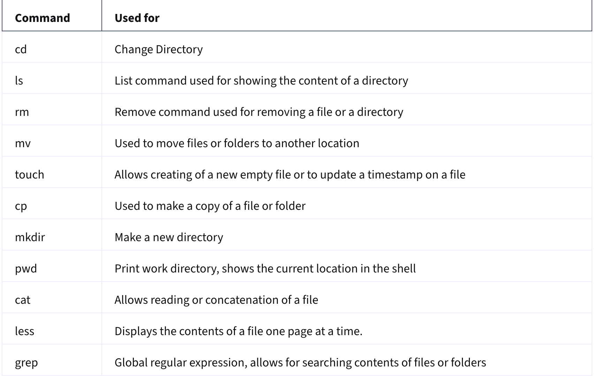

# Version Control Course

Source: Version Control: https://www.coursera.org/learn/introduction-to-version-control?specialization=meta-full-stack-developer

## Module2: Command Line (1-19)

### 1. The Command Line (video)

Graphical User Interfaces (GUIs): a system for interacting with electronic devices using visual elements like icons, buttons, and menus instead of text-based commands. They offer an easy way to interact with devices, but they limit the scope of human-computer interaction. 

Command line: its an alternative of GUI. It allows to perform tasks, such as creating directories, files, copying, moving files, performing advanced searches, writing scripts to automate processes, start and stop programs, etc... Usage is limitless. 

```
cd ~/Desktop        - change directory
touch example.txt   - create a new empty file
mkdir html          - make directory with the name of html
history             - to view the history of the most recently typed commands
code example.js     - it will open the file in VSCode
```

### 2. What are Unix commands? (video)
You interact with your phone and computer through a graphical user interface, which is just a layer above underlying commands that tells the device what to do. Example: creating new folder on your Desktop - you right click with the mouse and push the 'Creating new folder' button. The same in command line: you have to navigate to the Desktop folder and type command to create the folder. 

**Unix commands** are simply a layer below the normal actions. 
Each Unix command has a set of helper instructions, which give detailed information about how the commands can run and which 'flags' can be passed to that command.

```
man         - manual, it's a  helper command, it will display a detailed manual instructions of that given command. 

man ls      - detailed manual of instructions of list command 
ls          - list the contents of the current working directory 
ls -l       - '-l' is a flag, it gives a detailed list of content of the current directory (gives an ordered list, shows the read and write permissions and owners)
ls -a       - list all files, even the hidden ones 
pwd         - present working directory, shows the full path of the current directory 
cp          - copy, copies files or folders from one destination to another 
mv          - move files from one directory to another
```

### 3. Using Bash on Mac Terminal (reading)

Opening Terminal in Mac: 
1. Finder: Finder --> Applications --> Utilities --> Terminal 
2. Launch Pad - Press F4
3. Spotlight Search - Press Command + Space 




#### <ins>Editing files: </ins>

**VI or VIM**. <br>
VI stands for Visual Editor. <br>
VIM is better version of VI - Visual Editor iMproved<br>
When you open a file, you can navigate through text, search words, delete or copy lines, etc. 

```
h, j, k, l          - Move left, down, up and right
/searc_term         - search for a word or phrase
:w                  - save the file
:q                  - quit the editor
```

- Insert mode: Allows the contents of the files to be edited directly. It can be entered by pressing i (insert), a (append), or o (open new line).

- Command line mode:  It can be entered by typing colon : in Normal mode. 

### Using Bash on Windows
Let's create a simple script and make it executable!
- Open Terminal
- Navigate to the home directory and check the files
```
cd ~
ls -la
```

- create a new file and open it:
```
vim testshell.sh
```
- press 'i' for insert mode and type:
```
#!/bin/bash
```
- this lets the operating system know that this is a bash script 
```
echo "Hello World!"
```
- press 'escape' from get out insert mode, than press ':wq', which saves and quit the file. 

```
-rw-r--r--   1 anettkeszler  staff     32 Nov  7 13:20 testshell.sh
```
This file can't be run at the moment, it's not executable, it's just a read-write file. To be able to run the file, you can make it executable by adding the proper permission. 
```
chmod 755 testshell.sh
```
```
-rwxr-xr-x   1 anettkeszler  staff     32 Nov  7 13:20 testshell.sh
```
Now I can run the file from the command line. 
```
./testshell.sh
Hello World!
```

### 5. Checking the Working Directory (lab)

### 6. Change directories and list contents (video)
Practice pwd, ls, la -l, ls -la, cd, cd .., cd /  to navigate in the file system.

### 7. Creating and moving directories and files (video)
- Create a new directory and working with it 
```
mkdir test
cd test
touch test1.txt
touch test2.txt

cd .. 

mkdir test2
```

- Let's move the test folder into the test2 folder 
```
mv test test2
```
- Now the test folder (and all of its files) are moved into the test2 folder

### 8. Creating and navigating directories and files (dialogue)

- Rename a file and move it to another directory in one command: 
```
mv notes.txt ~/Markdown/notes.md
``` 
- Here I renamed the notes.txt files to notes.md and moved it to the Markdown folder. 

### 9. Create and manipulate Directories and Files (Lab)

### 12. Pipes

- Open a file for reading:
```
cat file.txt
```
- To count the number of words in a file:
```
wc file.txt -w        Outcome: 181 file.txt (the number of words)
```
'-w' flag tells the wc command to return the word count. 

Pipes allow you to pass the output of one command to be used as the input for a different command. 

```
ls | wc -w                  output: 2 (there is 2 file in the directory )
cat file.txt | wc -w        output: 181 (there is 181 words in the file1.txt file)
cat file1 file2 | wc -w     output: 362 (there is 362 words in the file1 and file2. 
```

### 13. Redirection

The basic workflow of any Linux command is that it takes an input and gives an output. The standard input device(stdin) is the keyboard, the standard output device(stdout) is the screen. 

With redirection you can change the standard input and/or output. 

There are 3 types of IO (input/output) redirection:

1. Standard Input
2. Standard Outout
3. Standard Error

The shell keeps a reference of standard input, output and error by a numbering system. 

The 0 is for standard input, 1 is for standard output, and 2 is for standard error. 

**1. Standard Input:**

**The standard input redirection gives you the option to record your input and save it to a file either by overwriting or appending the file.**<br>
Taking input usually refers to a user typing information from the keyboard. 
We use '<' sign for user input.
The cat command can be used to record user input and save it to a file. 
But how do we take input and store it in a .txt file? 
```
cat > input.txt
```
- write the input you want, press Enter, than ctr + d 
- to output the content of the file:
```
cat < input.txt         - to display the content of the file 
```

**2. Standard Output**

**The redirection standard output allow you to control where the output goes.**<br>
Output direction is handled with a greater than sign (>). IO allows us to use redirection to control where the output goes. 
To send output to a text file
Every time you run a command like ls, and press Enter, it sends the output of the file to an stdout file. In Linux, if you want to control, where the output goes, you can use a redirection. 
```
ls -l > output.txt
```
We tell to display the result of the 'ls -l' command to the output.txt file (which has not been created yet, but it will be created)
```
less output.txt           - it displays the result of ls -l command 
```

**3. Standard Error**<br>

**The standard error redirect allows you to specify that the error should be written to a file.** <br>
Errors occur when things go wrong. When using redirection, you also have to specify that the error should be written to a file. 
```
ls -l /bin/usr 2> error.txt
less error.txt     --> 'ls: /bin/usr: No such file or directory' is displayed in the error file
```

You can handle both output and error at once,
```
ls -l /bin/usr > error_output.txt 2>&1
```
```
< input.txt
> output.txt
2> error.txt
```


### 14. Grep

Global Regular Expression Print, and it's used for searching across files and folders as well as the contents of files. 
```
grep Sam names.txt
```
It searches all of the names starting with 'Sam' in names.txt file.
Grep is case sensitive, so 'sam' with lower case will return a complitely different list:
```
grep sam names.txt
```
To ignore case sensitivity we can pass in a flag. 
```
grep -i Sam names.txt
```
This time I get back both names that begin with Sam and also with 'sam' as a partial match in the middle or end of the name. 

We can also do an exact match by passing in a different flag, '-w', which means it'll match exactly what I'm looking for. 
```
grep -w Sam names.txt       - output: Sam 
```
In this case we only get back a single result with the name 'Sam', any partial matches are ignored.  

- Using pipe for combine searches:
```
ls /bin | grep zip 
```
First, I check all the executable files inside the bin directory, than I search for files containing 'zip' in their name. 


### 15. Hand on Lab: 
1. Count words in a file:
- Create a new file, file.txt, write "Welcome to Unix shell Programming" in the file, and count the number of the words in the file. 
```
touch file.txt
echo "Welcome to Unix Shell Programming >> file.txt"        - we use the redirection operator to write in the file 
cat file.txt | wc -w                                        - output: 5
```

2. Redirect errors to a file:
- List the contents of a non-existency directory and save the error message to a file:
```
ls -l /bin/dir-that-not-exist 2> error.txt
```
- Count the number of characters in the error.txt file:
``
wc -w < error.txt                                           - output: 7
```

3. Search for substrings in a file: 

```
echo "Unix is a powerful operating system. Learning unix  commands is very much essential to work on a Unix based system" >> file.txt

cat file.txt | wx -w               - output: 20 (counts the number of words in the file)

grep -i -w Unix file.txt | wc -w
```

Which of the following are benefits of using the command line?
The Command Line Interface (CLI) uses less CPU and memory than a Graphical User Interface (GUI)
Most cloud providers provide command line access.
Many tasks can be automated through the command line.